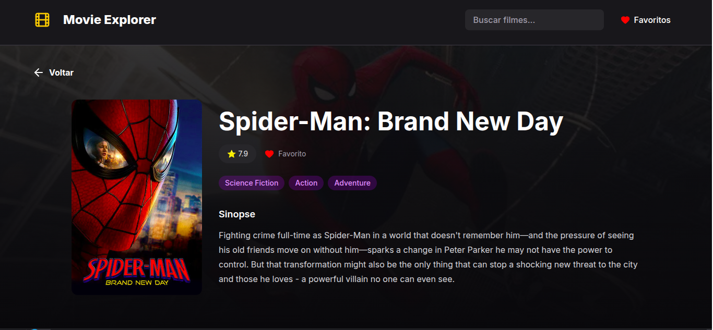
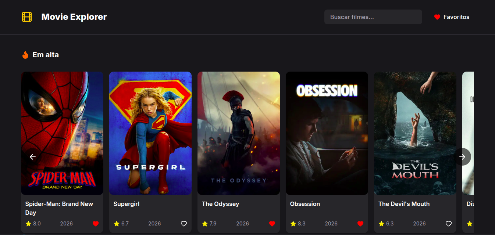
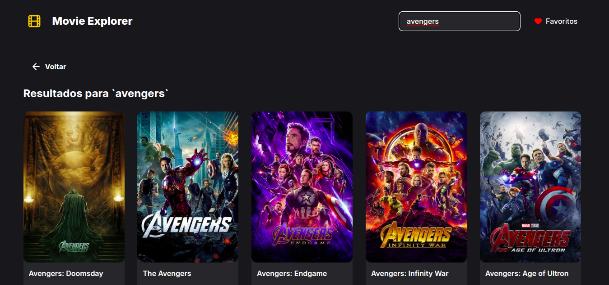

# Movie Explorer 🎬


Aplicação web para descoberta de filmes, desenvolvida com **Next.js**, **TypeScript** e **Tailwind CSS**, utilizando a API do **TMDB** para buscar e exibir informações sobre filmes.

O projeto permite explorar filmes por categorias, realizar buscas em tempo real, visualizar detalhes completos e criar uma lista de favoritos persistida no navegador.

## 🚀 Demonstração

🔗 [Acesse o Movie Explorer](https://movie-explorer-five-alpha.vercel.app/)

📸 **Preview:** 

<p align="center">
  
</p>

<p align="center">
  
  
</p>

## ✨ Funcionalidades

* 🎬 Listagem de filmes mais bem avaliados
* 🔥 Listagem de filmes populares
* 🆕 Listagem de lançamentos
* 🔎 Busca de filmes por nome
* 📖 Visualização dos detalhes de cada filme
* ❤️ Adição e remoção de filmes favoritos
* ⭐ Página com a lista de filmes favoritos
* 💾 Persistência dos favoritos utilizando `localStorage`
* 📱 Interface responsiva

## 🛠️ Tecnologias

* **Next.js**
* **React**
* **TypeScript**
* **Tailwind CSS**
* **TMDB API**
* **LocalStorage**
* **ESlint**

## 📁 Arquitetura

- Componentes reutilizáveis
- Hooks customizados
- Consumo da API do TMDB
- Persistência dos favoritos com LocalStorage

## ⚙️ Como executar o projeto

Clone o repositório:

```bash
git clone https://github.com/vanessakoch/movie-explorer.git
```

Entre na pasta:

```bash
cd movie-explorer
```

Instale as dependências:

```bash
npm install
```

Crie um arquivo `.env.local` na raiz do projeto e adicione sua chave da API do TMDB:

```env
TMDB_API_TOKEN=seu_token_aqui
```

Execute o projeto em ambiente de desenvolvimento:

```bash
npm run dev
```

Acesse:

```text
http://localhost:3000
```

## 📄 Licença

Este projeto está sob a licença MIT.